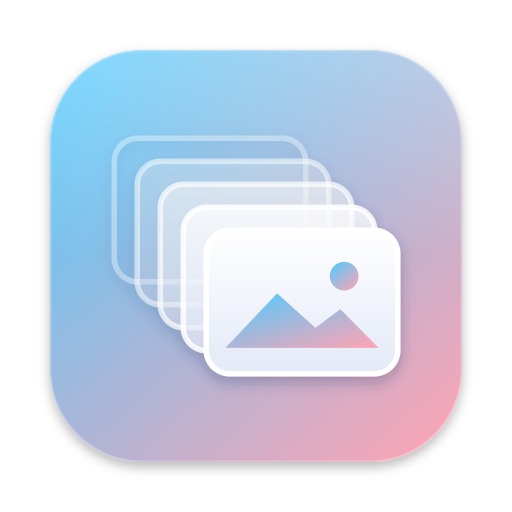

<div align="center">



# Firstcut

**A hyper-fast, burst-aware photo culler for macOS.**

Open a folder of RAW files from a shoot, let Firstcut split it into bursts, and pick your keepers with
the keyboard — without ever waiting for a photo to load.


[](https://github.com/Kathir-D/Firstcut/releases)
[](LICENSE)

</div>

> [!NOTE]
> Firstcut is a first release (v0.1). It is tested on macOS 26 with Canon EOS R8 files; see
> [Supported formats](#supported-formats) and [Known limitations](#known-limitations) before you
> trust it with your time that you can never get back :)

## Table of contents

- [Why Firstcut](#why-firstcut)
- [Features](#features)
- [How it works](#how-it-works)
- [Keyboard shortcuts](#keyboard-shortcuts)
- [Supported formats](#supported-formats)
- [Installation](#installation)
- [Known limitations](#known-limitations)
- [Architecture](#architecture)
- [Roadmap](#roadmap)
- [Contributing](#contributing)
- [License](#license)

## Why Firstcut

A single football game can produce 1,500 RAW files, most of them bursts of 10–40 frames of the same
play. Culling that in a general-purpose photo manager means waiting: after a few dozen photos the
preview stops keeping up, and every frame shows up blurry until it finishes loading.

Firstcut does one job — deciding what to keep — and is built around two ideas:

1. **Never wait.** Every photo you can reach is already decoded and on the GPU before you get there.
2. **Cull by burst, not by file.** The shoot is split into batches (one burst or moment each), so you
   compare frames of the same play side by side and pick the sharpest ones.

Firstcut does **not** use AI to rate or reject photos. You make every call; it just gets out of the way.

## Features

- ⚡ **Built not to make you wait** — the photos around the one you're on are decoded ahead of
  time, in the background, in priority order (the current frame first). The cache grows to a memory
  budget you set, and shrinks under memory pressure. No lazy loading, no progressive blur.
- 🎞️ **Automatic burst batching** — built from capture time (to the hundredth of a second), shutter
  count, lens and exposure data, and a lightweight visual comparison. Works from slow continuous
  shooting to 40 fps bursts, and ignores file-name rollover (`IMG_9999` → `IMG_0001`).
- ⭐ **Two rating modes**
  - **Stars** — 5–4 keep, 3 good, 1–2 maybe; anything unrated is treated as not kept.
  - **Keep / Not keep** — everything starts as not kept; tap one key to keep a frame. Green and red
    rings in the filmstrip show your picks at a glance.
- 🖥️ **Feels like Finder** — large photo with a filmstrip underneath, Liquid Glass toolbar, native
  macOS look. Always dark, so it doesn't affect how you judge a photo.
- 🔍 **Focus checking** — pinch to zoom, or click any spot to jump to 100% right there (click again to
  go back). Zoom lock keeps that spot as you arrow through a burst, and an overlay shows the camera's
  autofocus point.
- ℹ️ **Lightroom-style info panel**, histogram, clipping warnings, grid, and 2–4-up compare views.
- ⌨️ **Lightroom keyboard shortcuts** out of the box, every one remappable.
- 🔁 **Undo everything and resume anytime** — your progress is saved as you go.
- 🤝 **Plays well with Lightroom and Capture One** — ratings are written to standard `.xmp` sidecars.
- 🧹 **Finish step** — once every batch is done, choose what happens to the photos you didn't keep:
  move them to Trash or a subfolder, mark them rejected, copy your keepers somewhere else, and more.
  Originals are never modified.

## How it works

1. **Open a folder** containing the whole shoot (`⌘O` or drag it onto the window).
2. Firstcut reads the metadata of every file in parallel and **groups the shoot into batches**.
3. **Cull batch by batch**: use `←` `→` to move through the frames of a burst, rate with `1`–`5` (or
   `P` in Keep mode), and move to the next batch with `⌘→` or the toolbar buttons.
4. When you're done, **Finish Cull** (`⌘↩`) shows a summary and asks what to do with the photos you
   didn't keep.

## Keyboard shortcuts

Defaults match Lightroom Classic. All of them can be changed in **Settings → Keyboard**. Zooming
uses the mouse or trackpad instead of a key: pinch, or click a spot to view it at 100%.

| Action | Shortcut |
| --- | --- |
| Previous / next photo | `←` / `→` |
| Previous / next batch | `⌘←` / `⌘→` |
| Rate 1–5 stars / clear | `1`–`5` / `0` |
| Keep (Keep mode) · Pick flag | `P` |
| Reject / unflag | `X` / `U` |
| Color labels | `6` `7` `8` `9` |
| Info panel | `I` |
| Grid / Loupe / Compare | `G` / `E` / `C` |
| Auto-advance | `Caps Lock` |
| Undo / redo | `⌘Z` / `⇧⌘Z` |
| Finish Cull | `⌘↩` |

## Supported formats

Canon is the first priority. Firstcut reads the capture time, camera, lens, exposure settings and
orientation of every format below, opens JPEG/HEIC/PNG/TIFF folders exactly like RAW folders, and
**never skips a photo macOS can open**: a file whose metadata cannot be read still appears in the
filmstrip, ordered by its file date, with a warning.

| Brand | Formats | Metadata reader |
| --- | --- | --- |
| Canon | `.CR3` (including C-RAW) | Full: EXIF, MakerNote, shutter count, autofocus points. Verified against `exiftool` on 2,880 files |
| Canon | `.CR2` | EXIF, plus the MakerNote (drive mode, autofocus points) |
| Canon | `.CRW` | File date only (no reader for the old CIFF format) |
| Nikon | `.NEF`, `.NRW` | EXIF, plus shutter count where the camera stores it in the clear |
| Sony · Panasonic · Olympus · Pentax · Leica · Hasselblad · Phase One · Samsung · Kodak and others | `.ARW` `.SR2` `.SRF` · `.RW2` · `.ORF` · `.PEF` `.DNG` · `.RWL` · `.3FR` `.FFF` · `.IIQ` · `.SRW` · `.DCR` `.KDC` `.ERF` `.MEF` `.MOS` `.GPR` | EXIF (TIFF-based files) |
| Fujifilm | `.RAF` | EXIF from the embedded JPEG |
| Sigma | `.X3F` | File date only; embedded preview |
| Non-RAW | `.JPG`, `.HEIC`, `.HIF`, `.TIFF`, `.PNG` | EXIF |

Displaying a photo goes through macOS itself (ImageIO), so anything Preview can open, Firstcut can
show. RAW + JPEG/HEIF pairs are treated as a single photo.

> [!WARNING]
> Firstcut has **only been tested with Canon cameras** (CR3, including C-RAW). Every other reader is
> written from the published format specifications and checked against hand-built test files, but
> not against real files from those cameras. If something doesn't look right with yours, please
> [open an issue](https://github.com/Kathir-D/Firstcut/issues) with the camera model and format.

## Installation

> [!IMPORTANT]
> Requires a Mac with Apple Silicon running macOS 15 Sequoia or later. Intel Macs are not supported.
> Liquid Glass styling needs macOS 26 Tahoe or later; macOS 15 gets the closest native equivalent.
> Firstcut is only tested on macOS 26 and later; macOS 15 support is best effort.

### Homebrew (recommended)

```sh
brew tap Kathir-D/tap
brew trust Kathir-D/tap
brew install --cask firstcut
```

Installs to `/Applications/Firstcut.app` and updates with `brew upgrade --cask firstcut`. **No
Gatekeeper approval needed** — see the note below.

`brew trust` is required: Homebrew 7 refuses to load casks from an untrusted tap.

> **Why a personal tap?** Homebrew's official cask repository only accepts apps that pass Gatekeeper.
> Firstcut is ad-hoc signed and not notarized (the project has no paid Apple Developer account), so
> it's distributed through its own tap instead. The cask clears the quarantine attribute after
> Homebrew has verified the download's SHA-256, so the app opens without a prompt.

### Direct download

```sh
curl -fLO https://github.com/Kathir-D/Firstcut/releases/download/v0.1.0/Firstcut-0.1.0.zip
unzip Firstcut-0.1.0.zip
sudo mv Firstcut.app /Applications/
open /Applications/Firstcut.app
```

`curl` doesn't set the quarantine attribute, so this usually opens without a prompt. If macOS does
ask, approve it once in **System Settings › Privacy & Security › Open Anyway**. A download through a
browser always needs that step.

### Build from source

**Requirements:** Xcode 26 or later, Rust (stable, via [rustup](https://rustup.rs)),
[XcodeGen](https://github.com/yonaskolb/XcodeGen).

```sh
git clone https://github.com/Kathir-D/Firstcut.git
cd Firstcut
scripts/build-app.sh
open dist/Firstcut.app
```

`scripts/build-app.sh` builds the Rust core, generates the Xcode project, builds Release, ad-hoc signs
the app, and leaves it at `dist/Firstcut.app`. To work in Xcode instead:

```sh
brew install xcodegen
scripts/build-core.sh     # Rust core + Swift bindings
xcodegen                  # generates Firstcut.xcodeproj
open Firstcut.xcodeproj   # run the Firstcut scheme
```

Run the Rust tests with `cargo test --manifest-path core/Cargo.toml` (they also run on Linux) and the
Swift tests with `scripts/generate-project.sh` followed by `xcodebuild -project Firstcut.xcodeproj
-scheme Firstcut -destination 'platform=macOS,arch=arm64' test`. Tests that need real photos
look in `FIRSTCUT_TEST_PHOTOS` (default `~/Documents/testing`) and skip themselves if it's missing.

## Architecture

| Layer | Technology | Responsibility |
| --- | --- | --- |
| Interface | SwiftUI + AppKit | Window, toolbar, viewer, filmstrip, settings, Liquid Glass |
| Image pipeline | ImageIO, Core Image, Metal | Preview and RAW decoding, tiered cache, GPU display |
| Core | Rust (via UniFFI) | Metadata parsing, ordering, batching, SQLite session, XMP sidecars, file operations |

Details, performance targets, and design decisions are in [`todo.md`](todo.md).

## Known limitations

Firstcut v0.1 is deliberately small, and honest about what it hasn't proven yet.

- **Batching accuracy is not independently measured.** The burst-splitting rules were tuned on four
  Canon R8 football shoots (2,880 photos) and are covered by tests on their metadata, but they have
  not been scored against a hand-checked answer key, so no accuracy percentage is claimed. Batches
  are automatic: there is no manual split or merge.
- **Speed is not benchmarked on a range of machines.** The design keeps the photos you can reach
  already decoded; the timings in [`todo.md`](todo.md) are targets, not measurements.
- **macOS 26 (Tahoe) is the tested system.** macOS 15 gets the closest native styling and should
  work, but hasn't been run.
- **Apple Silicon only**, and the app is ad-hoc signed rather than notarized (there is no paid Apple
  Developer account), so a browser download needs a one-time approval; Homebrew and `curl` don't.
- **No "exact RAW" decode.** Photos are shown from the full-size JPEG the camera embeds in every RAW.
  That is the same image the camera showed you, at full resolution, not a fresh RAW render.
- **English only, one folder per session, no editing** — by design for v0.1 (see [`todo.md`](todo.md); manual batch split/merge and preset-based batch edits are planned for later, §16).

## Roadmap

- [x] Rust core: metadata reading, ordering, burst batching, session database, XMP sidecars
- [x] Prefetching image pipeline (the photos around the current one decoded ahead of time)
- [x] Finder-style interface with both rating modes
- [x] Pinch and click zoom, zoom lock, autofocus overlay, clipping warnings, info panel, grid, compare
- [x] Finish Cull with dry run and undo, and a Settings window with a shortcut editor
- [x] Metadata for JPEG, HEIF, PNG, TIFF and the TIFF-based RAW formats
- [x] v0.1.0 on GitHub Releases and Homebrew
- [ ] Batching accuracy measured against a hand-checked answer key
- [ ] Verification on real Sony, Nikon, Fujifilm and other cameras
- [ ] Sparkle in-app updates

## Contributing

Issues and pull requests are welcome. Before starting on something big, please open an issue to
discuss it. Keep changes focused, run `cargo fmt`, `cargo clippy`, and the test suites before
submitting, and never commit photos — test images stay outside the repository.

## License

Firstcut is free software released under the [GNU General Public License v3.0](LICENSE). You can
use, study, change, and share it. If you distribute a modified version, you must release its source
code under the same license.
